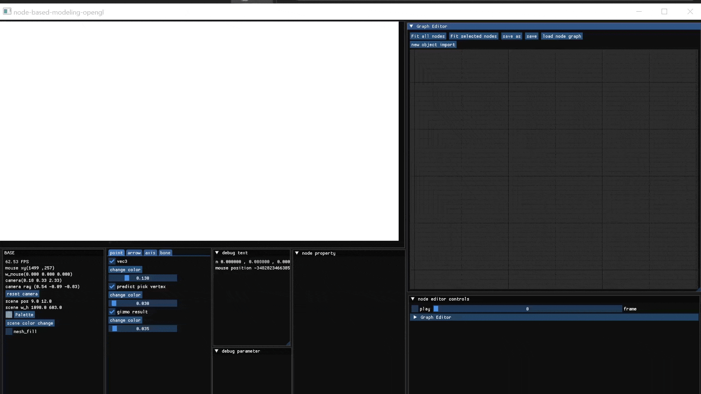
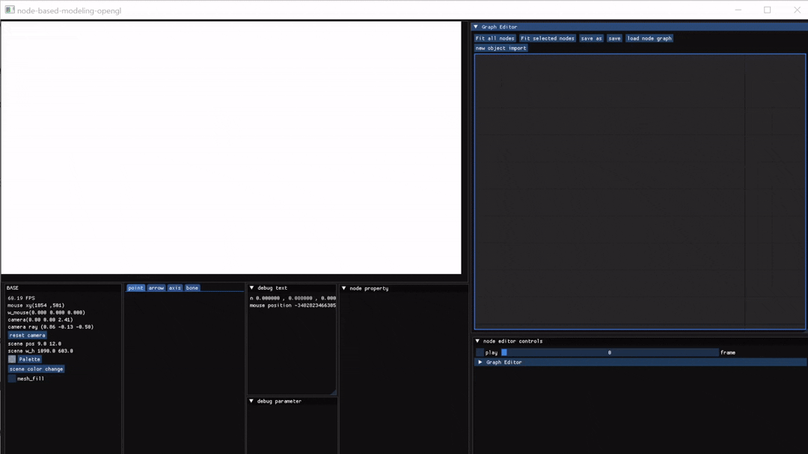
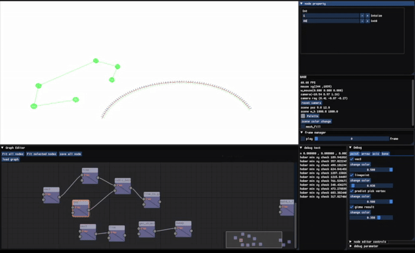

# node-based-modeling-opengl
node-based modeling tool developed for personal CG studies and experiments.  
The node UI was developed based on ImGuizmo.


This project is a work in progress, and features are still under development.  
However, this project is part of another private project, so updates are irregular.

⚠️ Note
- It has not been confirmed whether this project can run in environments below C++17. The development environment uses C++20.

## Example
To help you understand how this program works, we provide an example **Chain** demonstration below.


### How to run
1. Click the **Load Node Graph** button in the application.  
2. Select the `Chain.json` file located in the `example_node` folder.  
3. The example  will be loaded and ready to use.

## Features & Controls
### Assigned Keys
Most interactions are performed using **mouse clicks** and **right-clicks**.
Currently, the only keyboard keys in use are **Shift**, **Delete**, and **P**.
When you want to move or resize the window, hold P.

### Controls

#### Scene Navigation
- Move the scene using **WASD** keys and the **mouse scroll wheel**.  
- **Right-click and drag** to rotate the camera view.

#### Nodes and Links

- **Right-click** on the node editor to open the node generator popup.  
  Right-click again to close it.  
- Node types: **func, animation, gen_object, object, shader, setting**  
- `gen_object` creates objects that are defined purely in code. Examples include **Circle** and **Sphere**.
- `object` handles objects that are imported from external files.
- Select a node and press **Delete** to remove it.  
- Drag a node's **output** to another node's **input** to create connections.  
- Node properties can be modified in the **Node Property panel**.  
- The panel includes a **Draw** option for each node.  (Note: If subsequent nodes are connected, a node may not draw due to value overwriting. I am aware of this issue, but it is not critical, so there are no immediate plans to fix it.)

#### Gizmo Controls

- Nodes that have objects, `vec3`, or `mat4` values can display a **Gizmo** when selected and in Draw mode, which can be manipulated with the mouse using **Shift + Click**.
- When the Gizmo is displayed, pressing **T** enables **Translation**, and pressing **R** enables **Rotation**.  
**Scale** manipulation is planned for future development.

### Save & Load
You can save and load the current state of all nodes using the **Save**, **Save As**, and **Load Node Graph** buttons.  
Save files are stored in **JSON** format.

### Planned Development
A keyframe editing feature is currently being implemented using ImGizmo’s ImSequencer.
At this stage, the key_frame_sequence nodes support output for float types only.

## Install (Windows)
You can install the project using Cmake

Clone the repository and move to the project root directory:
```bash
cd node-based-modeling-opengl
```

```bash
mkdir build
```

```bash
cd build
```

```bash
cmake .. -G "Visual Studio 17 2022"
```

## Development Environment
- **OS:** Windows 10  
- **CPU:** AMD Ryzen 7 3700X  
- **IDE:** Visual Studio 2022
-  **Language Standard:** C++20  

## Dependencies
- [GLFW](https://www.glfw.org/)  
- [Glad](https://glad.dav1d.de/)  
- [ImGui](https://github.com/ocornut/imgui)  
- [ImGuizmo](https://github.com/CedricGuillemet/ImGuizmo)  
- [GLM](https://github.com/g-truc/glm)  
- [stb_image](https://github.com/nothings/stb/blob/master/stb_image.h)  

## Attribution
LearnOpenGL tutorials
- Copyright © Joey de Vries  
- Source: [https://learnopengl.com](https://learnopengl.com)  
- Twitter: [@JoeyDeVriez](https://twitter.com/JoeyDeVriez)  
- Licensed under: [CC BY 4.0](https://creativecommons.org/licenses/by/4.0/)

OpenCloth
Some parts of the code from OpenCloth are included for simulation features and personal study purposes.
- Copyright © Movania Muhammad Mobeen
- Source: [https://github.com/mmmovania/opencloth](https://github.com/mmmovania/opencloth)
- Email : mova0002@e.ntu.edu.sg
- Licensed under: BSD 2-Clause License
